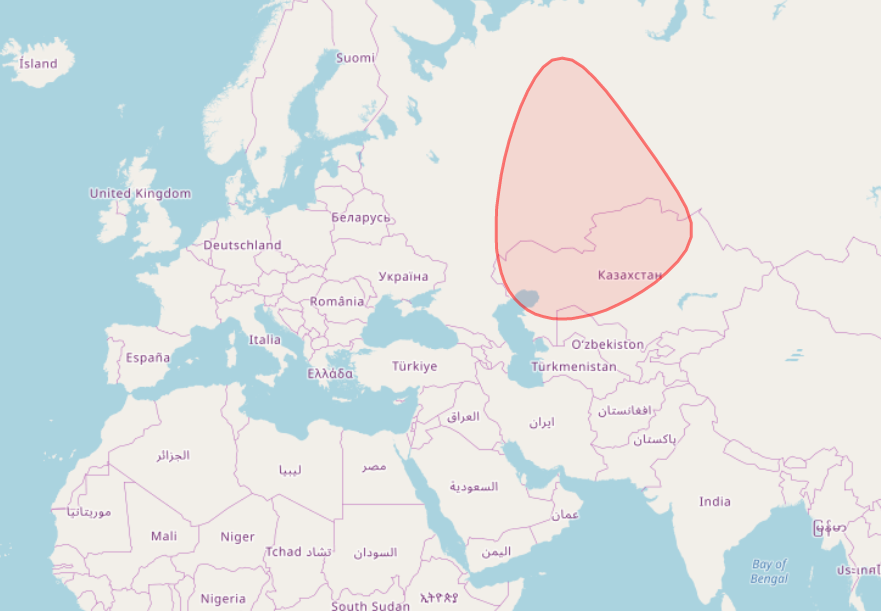

# sat-beam

:satellite: calcuates the beam a satellite projects on the earth's surface



## Usage

```js
const { getBeam } = require('sat-beam')

const lng = 2.0 // degrees
const lat = 52.0 // degrees
const radius = 100.0 //km

const points = getBeam(lng, lat, radius)

/*
[ { lat: 53.975960615468395, lng: 1.999999999997981 },
  { lat: 53.959810572100736, lng: 2.112830670635857 },
  { lat: 53.91167290927757, lng: 2.2238947168825023 },
  ...
*/
```

## License

MIT
